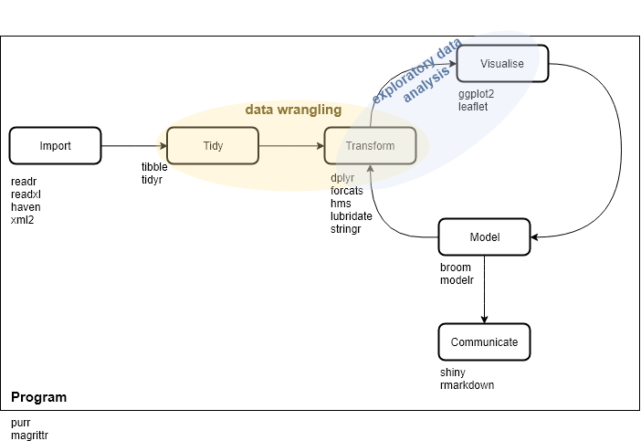

```{r setup, include=FALSE}
library(knitr)
knitr::opts_chunk$set(warning=FALSE, message=FALSE)
```

#R conference 2018

by Emily Robinson (DataCamp) at the 2018 New York R Conference
Les packages de l'écosystème tidyverse sont décrits dans le diagramme 1. Noter que leaflet ne fait pas partie
de tidyverse.

```{r}
library(tidyverse)
tidyverse_packages()
```



##make a toy dataset

```{r}
library(tibble)
df <- tribble(
~date, ~whatever, ~numstuff1, ~numstuff2, ~multi_value,
"10-09-2017", .1, 5, NA, "val1, val2, val3",
"10-09-2017", .5, 1, 3, "val1",
"11-09-2017", .2, 3, 2, "val1, val2",
"12-09-2017", .5, Inf, 3, "val1, val2, val3, val4"
)
df
```

Examine your NAs and empty values

```{r}
library(purrr)
df %>%
  purrr::map_df(~sum(is.na(.))) # count the NA for every columns of a DF
```

```{r}
library(dplyr)
df <- df %>%
  na_if(Inf) # convert empty values into NA values
df
```

##Examine your numeric columns

```{r}
library(skimr)
df %>%
  select_if(is.numeric) %>%
  skimr::skim() # summary of all the numeric columns
```

##Tidy columns containing colon separated values
```{r}
library(tidyr)
library(stringr)
df <- df %>%
mutate(colonne = str_split(multi_value, ",")) %>% # transform into a list of characters
unnest() # split into seperate observations
```

##plot uncluttered bar charts
```{r}
library(ggplot2)
library(forcats)
df %>%
count(date) %>%
mutate(date = fct_reorder(date, n)) %>% # ordonne les colonnes en ordre décroissant
ggplot(aes(x = date, y = n)) + geom_col() + coord_flip()
```

#Sams Teach Yourself R

By Andy Nicholls, Richard Pugh, & Aimee Gott (first edition dec 2015)
object types

4 modes (fonction mode()):

- numeric
- character
- boolean
- complex

3 types (fonction class()):

- vector (c'est le type de base) - attributes length et names
- matrix/array - attribut dim
- list

##cut et split

cut est utilisé pour classer des données numériques en facteur
```{r}
numeric_matrix <- 1:100
mycut1 <- cut(numeric_matrix, 3) # classifie les données selon trois classes de valeurs égales
head(mycut1)
```

```{r}
table(mycut1)
```

On peut aussi couper selon des classes numériques spécifiques
```{r}
mycut2 <- cut(numeric_matrix, breaks = c(1, 10, 100), include.lowest = TRUE) # classes [1, 10], ]10, 100]
head(mycut2)
```

```{r}
table(mycut2)
```

La fonction split permet de découper un ensemble selon des facteurs. Donc on peut combiner les fonctions
cut et split pour décomposer un vecteur ou DF en liste de vecteurs/DF groupées par facteur.

```{r}
mysplit_list <- split(numeric_matrix, mycut2)
```

la fonction split fonctionne aussi sur des DF

```{r}
df <- data.frame(value = sample(1:1000, size = 100), whatever = LETTERS[sample(1:length(LETTERS), size = 100, replace=TRUE)])
split(df, cut(df$value, 3))
```

#Advanced R

The book [Advanced R](https://adv-r.hadley.nz/) explains a lot of fundamental aspects of the R language.

The library **lobstr** allows to check the size of a variable 

```{r}
library(lobstr)
obj_size(1)
```

Main object types

```{r, echo=FALSE}
show_type <- function(element) {
  show(element)
  show(typeof(element))
  str(element)
}
```

```{r}
t1 <- c(1:5)
```

```{r}
show_type(t1)
```

```{r}
t2 <- c(1.1, 1e2)
show_type(t2)
```

```{r}
t3 <- c("dog", "cat")
show_type(t3)
```

```{r}
t4 <- c(TRUE, FALSE)
show_type(t4)
```

```{r}
t5 <- list(1:2, 2:3)
show_type(t5)
```

```{r}
t6 <- data.frame(col1 = c(1:5), col2 = letters[1:5])
show_type(t6)
```