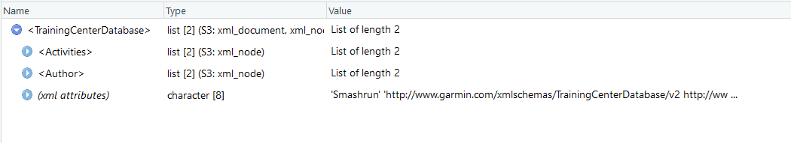
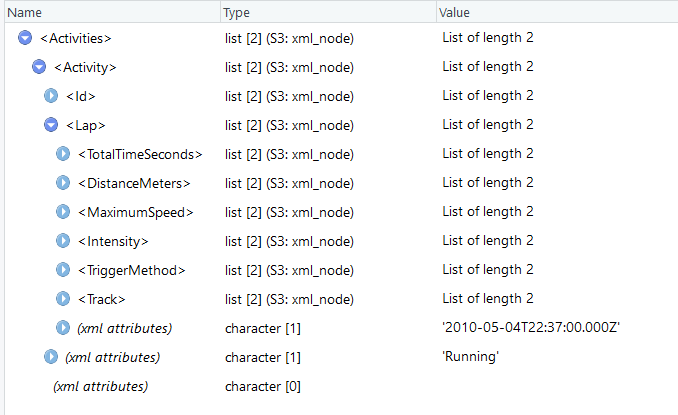
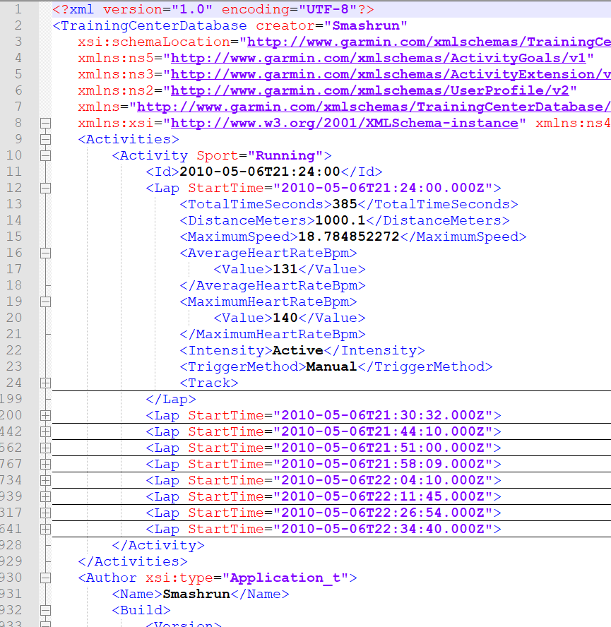

```{r setup}
knitr::opts_chunk$set(warning=FALSE, message=FALSE, include=FALSE)
library(knitr)
library(xml2)
library(tidyverse)
```

```{r}
DATASET_DIRECTORY <- "/DATASETS/smashrun/RAW.unzipped"
setwd(DATASET_DIRECTORY)
file_list <- dir()
```

The raw data is located in the directory: **`r DATASET_DIRECTORY`** and comprises **$`r length(file_list)`$** files

```{r}
testFileName <- file_list[1]
setwd(DATASET_DIRECTORY)
out <- readLines(testFileName, n=-1) # read all the lines of the file into a vector of characters
```


```{r mockup1}
library(stringr)
toto <- str_c(out, collapse = "") # concatenate all the lines into one line
test <- read_xml(toto, as_html = FALSE, options = c("NOBLANKS","RECOVER"), verbose=TRUE)
```

Validation against the XMLschema

Here is the header of a sample file:
`<?xml version="1.0" encoding="UTF-8"?>`
`<TrainingCenterDatabase creator="Smashrun"`
`   xsi:schemaLocation="http://www.garmin.com/xmlschemas/TrainingCenterDatabase/v2` **`http://www.garmin.com/xmlschemas/TrainingCenterDatabasev2.xsd" `**
`   xmlns:ns5="http://www.garmin.com/xmlschemas/ActivityGoals/v1" `
`   xmlns:ns3="http://www.garmin.com/xmlschemas/ActivityExtension/v2" `
`   xmlns:ns2="http://www.garmin.com/xmlschemas/UserProfile/v2" `
`   xmlns="http://www.garmin.com/xmlschemas/TrainingCenterDatabase/v2" `
`   xmlns:xsi="http://www.w3.org/2001/XMLSchema-instance" ` `xmlns:ns4="http://www.garmin.com/xmlschemas/ProfileExtension/v1">`


```{r mockup2}
schema <- read_xml("http://www.garmin.com/xmlschemas/TrainingCenterDatabasev2.xsd")
xml_validate(test, schema)
```

On voit quelques écarts mais ce n'est pas un indicateur de mauvaise qualité des données (ie information manquante, érronée, etc...)

##Étude du schéma

L'emplacement du schéma à changé d'emplacement :

`yannick@debian:~$ curl https://www.garmin.com/xmlschemas/TrainingCenterDatabasev2.xsd`
`<!DOCTYPE HTML PUBLIC "-//IETF//DTD HTML 2.0//EN">`
`<html><head>`
`<title>301 Moved Permanently</title>`
`</head><body>`
`<h1>Moved Permanently</h1>`
`<p>The document has moved <a href="http://www8.garmin.com/xmlschemas/TrainingCenterDatabasev2.xsd">here</a>.</p>`
`</body></html>`

Il peut-être téléchargé via la nouvelle URL:

`yannick@debian:~$ curl https://www8.garmin.com/xmlschemas/TrainingCenterDatabasev2.xsd`


```{r mockup3}
# Exract the root node form the xml file.
rootnode <- xml_root(test)
mode(rootnode)
str(rootnode)

# Find number of nodes in the root.
rootsize <- xml_length(rootnode)

# Print the result.
print(rootsize)
```




```{r mockup4}
child1 <- xml_child(rootnode, 1)
mode(child1)
str(child1)
child1
```

```{r mockup5}
child2 <- xml_child(rootnode, 2)
child2
```

Seuls les éléments Lap (1 Lap par activité) et Track (liste de geolocations) semblent être disponibles



##Vérification que l'ensemble des fichiers reflètent cette même structure

Exploration des éléments **/ (racine)**

Le premier exemple montre un fichier contenant uniquement deux éléments (parmi d'autres tels que Folders, Workouts, Courses, Extensions):

- Author
- Activities

```{r checkDataStructure1}
setwd(DATASET_DIRECTORY)
#for (i in 1:length(file_list)) {
#for (i in 1:10) {
i <- 1
#  fileName <- file_list[i]
fileName <- "smashrun-2017-09-30-11142058.tcx"
  out <- readLines(fileName, n=-1) # read all the lines of the file into a vector of characters
  out1 <- str_c(out, collapse = "") # concatenate all the lines into one line
  out2 <- read_xml(out1, as_html = FALSE, options = c("NOBLANKS","RECOVER"), verbose=TRUE)  
  rootnode <- xml_root(out2)
  rootsize <- xml_length(rootnode) # Find number of nodes in the root.
  for (ii in 1:rootsize) {
    child <- xml_child(rootnode, ii) # lit chaque élément disponible sous la racine du document XML
    name <- xml_name(child) # récupère le nom de l'élément
    size <- xml_length(child) # ainsi que le nombre d'éléments contenus
    rowDf <- data.frame(fileName = fileName, childName = name, childEntries = size)
    if (i == 1 && ii == 1) df <- rowDf else df <- rbind(df, rowDf)
  }
#}
```

```{r checkDataStructure_summary1, include=TRUE}
df %>%
  group_by(childName) %>%
  summarise(min = min(childEntries), max = max(childEntries))
```

Donc on voit que l'élément **/Activities** n'a jamais plus d'une occurrance d'activité dans nos données.

Author à toujours 2 éléments : **/Author/Name** et **/Author/Build** correspondant à l'application SmashRun (pas vraiment d'interêt)

Exploration de l'élément **/Activities/Activity**

```{r checkDataStructure2}
setwd(DATASET_DIRECTORY)
#for (i in 1:length(file_list)) {
for (i in 1:10) {
#i <- 1
  fileName <- file_list[i]
#fileName <- "smashrun-2017-09-30-11142058.tcx"
  out <- readLines(fileName, n=-1) # read all the lines of the file into a vector of characters
  out1 <- str_c(out, collapse = "") # concatenate all the lines into one line
  out2 <- read_xml(out1, as_html = FALSE, options = c("NOBLANKS","RECOVER"), verbose=TRUE)  
  rootnode <- xml_root(out2)
  rootsize <- xml_length(rootnode) # Find number of nodes in the root.
  for (ii in 1:rootsize) {
    childRoot <- xml_child(rootnode, ii) # lit chaque élément disponible sous la racine du document XML
    nameRoot <- xml_name(childRoot) # récupère le nom de l'élément
    if (nameRoot == "Activities") {
        childActivity <- xml_child(childRoot) # on sait qu'il n'y a qu'une seule entrée Activities par document
        sizeActivity <- xml_length(childActivity)
        for (iii in 1:sizeActivity) {
          child <- xml_child(childActivity, iii) # lit chaque élément disponible de l'élément Activity
          size <- xml_length(child) # ainsi que le nombre d'éléments contenus
          name <- xml_name(child) # récupère le nom de l'élément
          attributs <- str_c("", xml_attrs(child))
          #print(attributs)
          rowDf <- data.frame(fileName = fileName, childName = name, childEntries = size, childAttr = attributs)
          if (i == 1 && iii == 1) dfActivities <- rowDf else dfActivities <- rbind(dfActivities, rowDf)
        }
    }
  }
}
```


```{r checkDataStructure_summary2a, include=TRUE}
dfActivities %>%
  group_by(fileName, childName) %>%
  summarise(n = n()) %>%
  group_by(childName, fileName) %>%
  summarise(n = sum(n)) %>%
  group_by(childName) %>%
  summarise(min = min(n), max = max(n))
```

Lorsqu'un Lap n'a qu'une seule occurrence il s'agit d'une saisie manuelle de l'entrainement et donc il ne devrait pas y avoir de tracking associé (élément /Activities/Activity/Lap/Track absent)

```{r checkDataStructure_summary2b, include=TRUE}
dfActivities %>%
  filter(childName == "Lap") %>%
  group_by(fileName) %>%
  summarise(n = n()) %>%
  ungroup() 
  #filter(n == 1)
```


exploration du contenu des attributs pour les éléments vides **/Activities/Activity/Id** et **/Activities/Activity/Notes**

```{r checkDataStructure_summary2c, include=TRUE}
dfActivities %>%
  filter(childName == "Notes" & childAttr != "")
```

```{r checkDataStructure_summary2d, include=TRUE}
dfActivities %>%
  filter(childName == "Id" & childAttr != "")
```

Exploration de l'élément  **/Activities/Activity/Lap** 



Il semble que, par défaut, un lap corresponde à 1 km et l'attribut Id correspond par défaut au ts de début du lap disponible au niveau de l'attribut StartTime de l'élément Lap.

Exploration de l'élément  **/Activities/Activity/Lap/Track** 

##Lecture de l'ensemble des données (format tidy)

Dans un premier temps on 
